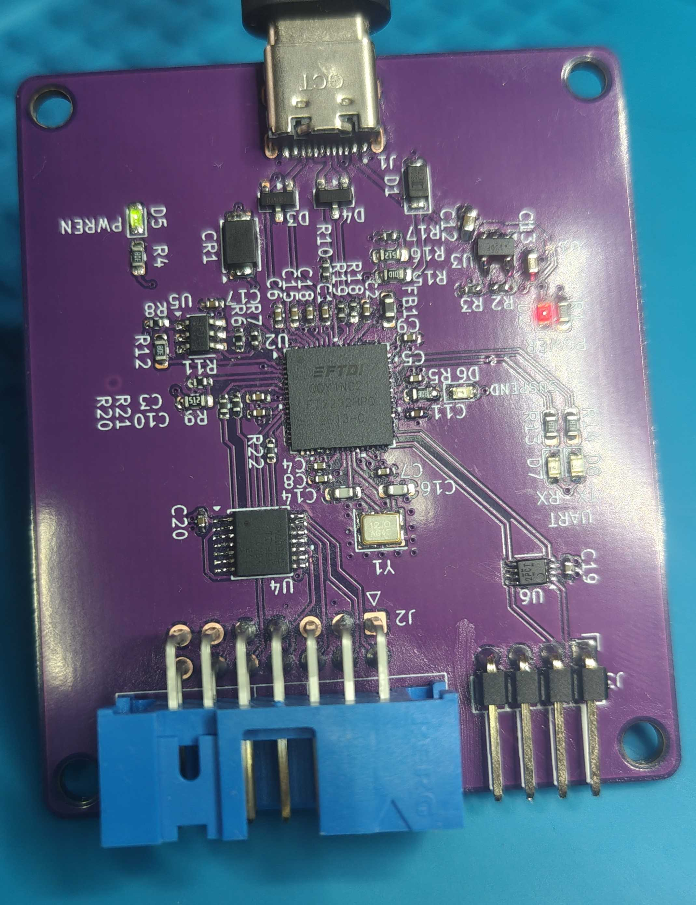
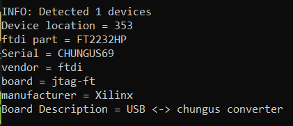

# JTAG-FT

A simple FT2232HP board to program and debug fpgas and other jtag capable hardware.

features:
- JTAG, 14pin xilinx jtag connector compatible
- UART
- Voltage level shifters for both UART and JTAG (1V1-5V)


setups:
- Xilinx fpga programmer:\
  download Vivado(2025.1 or newer) then use the included program_ftdi.\
  command:\
  ```program_ftdi -write -ftdi FT2232HP -serial 0ABC01 -vendor "my vendor co" -board "my board" -desc "my product desc" ```\
  After this Vivado should be able to see the board as a valid programming cable
  [official guide](https://docs.amd.com/r/en-US/ug908-vivado-programming-debugging/JTAG-Cables-and-Devices-Supported-by-hw_server)

- Lattice fpga programmer: TODO


- Altera fpga programmer: TODO

images:
assembled board



FT2232HP properties flashed


